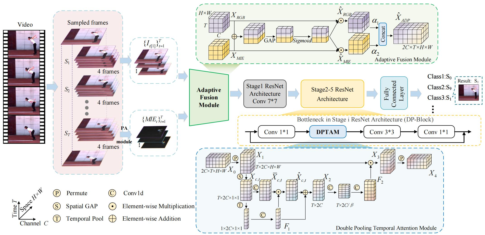

# MIE-Net: Motion Information Enhancement Network for Action Recognition


## Main Contribution

While benchmark datasets in daily scenes have yielded satisfactory results in current action recognition tasks, challenges still exist in sports action recognition tasks due to action similarity. It is crucial for fine-grained action recognition tasks to mine dynamic motion information efficiently in videos. In this paper, we propose an **Adaptive Fusion Module** (AFM) that selectively extracts the relationships to emphasize the interaction between RGB features and motion-enhanced features and a **Double Pooling Temporal Attention Module** (DPTAM) to enhance important features by temporal modeling. Based on the above two innovative modules, we form an end-to-end video action recognition framework, namely Motion Information Enhancement Network (MIE-Net). Then, we construct a specific Standing Long Jump Dataset (SLJD), aiming at decomposing SLJ actions in a fine-grained manner. Our experimental results demonstrate superior performance in recognition accuracy and efficiency.


- [Overview](#Overview)

- [SLJD](#SLJD)

<!-- - [AFM](#AFM)

- [DPTAM](#DPTAM) -->


## Overview

<div  align="center">    
    
    <br>
    <div style="color:orange; border-bottom: 2px solid #d9d9d9;
    display: inline-block;
    color: #999;
    padding: 10px;">
      The overall architecture of Motion Information Enhancement Network (MIE-Net).
  	</div>
</div>


We form an end-to-end action recognition framework named Motion Information Enhancement Network (MIE-Net). Given an input video V, we perform video frame sampling and create the set of RGB and PA features. Next, we emphasize the interaction between two features via Adaptive Fusion Module (AFM). Then, we feed the fused features into the backbone and implement temporal modeling by Double Pooling Temporal Attention Module (DPTAM) during feature extraction. Finally, the class scores are output by a fully connected layer.

## AFM

<!-- <div  align="center">    
    
    <br>
    <div style="color:orange; border-bottom: 2px solid #d9d9d9;
    display: inline-block;
    color: #999;
    padding: 10px;">
      <!-- The overall architecture of Motion Information Enhancement Network (MIE-Net).
  	</div>
</div> -->

Adaptive Fusion Module (AFM) is designed to emphasize information interaction and information attention, which selectively extracts the relationships between RGB features and motion-enhanced features.

## DPTAM
<!-- <div  align="center">    
    
    <br>
    <div style="color:orange; border-bottom: 2px solid #d9d9d9;
    display: inline-block;
    color: #999;
    padding: 10px;">
      <!-- The overall architecture of Motion Information Enhancement Network (MIE-Net).
  	</div>
</div>  -->

Double Pooling Temporal Attention Module (DPTAM) is proposed to model the interdependencies among time and channels, which can be plug-and-play in the backbone network to refine the feature information. The module employs spatial operations to adjust the global information and temporal operations to capture the local receptive field, resulting in the effective calibration of spatio-temporal information.


## SLJD

<div  align="center">    
    
    <br>
    <div style="color:orange; border-bottom: 2px solid #d9d9d9;
    display: inline-block;
    color: #999;
    padding: 10px;">
      <!-- The overall architecture of Motion Information Enhancement Network (MIE-Net). -->
  	</div>
</div>

SLJD is a classification dataset on the Standing Long Jump, containing over 1 thousand video clips in 10 classes. Each untrimmed video includes six main procedures for preparation, arm swing, takeoff, flight, landing, and buffering. Compared with the spatial semantic information in the scene, the subtle dynamic information between the limbs should be focused, which is conducive to the accurate analysis of SLJ.

### Examples

<table>
  <tr>
    <td >
    <center>
    
    <div style="color:orange; border-bottom: 1px solid #d9d9d9;
    display: inline-block;
    color: #999;
    padding: 2px;">Arm at backward highest → Heel off ground</div>
    </center>
    </td>
    <td ><center>
    <div style="color:orange; border-bottom: 1px solid #d9d9d9;
    display: inline-block;
    color: #999;
    padding: 2px;">Arm backward stretch  → Thigh vertical to ground</div>
    </center>
    </td>
  </tr>
</table>

## Content


- [Prerequisites](#prerequisites)

- [Data Preparation](#data-preparation)

- [Pretrained Models](#pretrained-models)

- [Testing](#testing)

- [Training](#training)


## Prerequisites


The code is built with following libraries:


- python 3.8 or higher

- [PyTorch](https://pytorch.org/) 1.9 or higher

- [torchvision](https://github.com/pytorch/vision) 0.10 or higher

- [TensorboardX](https://github.com/lanpa/tensorboardX)

- [tqdm](https://github.com/tqdm/tqdm.git)

- [scikit-learn](https://scikit-learn.org/stable/)

- [opencv-contrib-python](https://pypi.org/project/opencv-contrib-python/) 4.5 or higher

- [matplotlib](https://pypi.org/project/matplotlib/) 3.5 or higher


## Data Preparation

Following the common practice, we need to first extract frames of videos for convenience. Please refer to [TSN](https://github.com/yjxiong/temporal-segment-networks) and [TSM](https://github.com/mit-han-lab/temporal-shift-module) repos for the detailed guide of data pre-processing. We have successfully 
performed preprocessing on [SLJD](https://pan.baidu.com/s/1mUlCzEISaH4wJHTn9L6m8w?pwd=2023), [Something-Something-V2] (https://20bn.com/datasets/something-something/v2), [Diving48](http://www.svcl.ucsd.edu/projects/resound/dataset.html) datasets with this codebase. Basically, the processing of video data can be summarized as follows:


- Extract frames from videos.

  1. Firstly, you need clone [vidtools](https://github.com/liu-zhy/vidtools.git):

     ```bash
     git clone https://github.com/liu-zhy/vidtools.git & cd vidtools
     ```

   2. Extract frames by running:

      ```
      python extract_frames.py VIDEOS_PATH/ \
      -o DATASETS_PATH/frames/ \
      -j 16 --out_ext png
      ```

      We suggest you use ```--out_ext jpg``` with limited disk storage.

- Generate the annotation.

  The annotation usually includes train.txt, val.txt and test.txt (optional). The format of *.txt file is like:

  ```
  frames/video_1 num_frames label_1
  frames/video_2 num_frames label_2
  frames/video_3 num_frames label_3
  ...
  frames/video_N num_frames label_N
  ```

  The pre-processed dataset is organized with the following structure:

  ```
  datasets
    |_ SLJD
      |_ frames
      |  |_ [video_1]
      |  |  |_ img_00001.png
      |  |  |_ img_00002.png
      |  |  |_ ...
      |  |_ [video_2]
      |     |_ img_00001.png
      |     |_ img_00002.png
      |     |_ ...
      |_ annotations
         |_ train.txt
         |_ val.txt
         |_ test.txt (optional)
  ```

- Configure the dataset in [ops/dataset_configs.py](ops/dataset_configs.py).


## Model ZOO
Here we provide some off-the-shelf pretrained models. The accuracy might vary a little bit compared to the paper, since the raw video of Sth-Sth v2 and Diving48 downloaded by users may have some differences.


| Models  | Datasets | Resolution | Frames | Val Top-1 | Val Top-5 |                         Checkpoints                          |
| :-----: | :--------: | :--------: | :--------: | :-------: | :-------: | :----------------------------------------------------------: |
| DPTAM | SLJD | 224 * 224  | 3+3*4 | 90.69% | 98.99% | [ckpt](https://pan.baidu.com/s/1f_uT5r0TAq9EM5aMvrUFyw?pwd=sljd) |
| MIE-Net | SLJD | 224 * 224  | 3+3*4 | 94.48% | 99.65% | [ckpt](https://pan.baidu.com/s/1IvH96zBG9dvpEge4A13gQw?pwd=sljd) |
| DPTAM  | Diving48 | 224 * 224  | 8+8*4 | 77.61% | 96.54% | [ckpt](https://pan.baidu.com/s/1nRlWDKXepajG_Ek4nvhd5g?pwd=divi) |
| MIE-Net | Diving48 | 224 * 224  | 8+8*4 | 80.2% | 98.17% | [ckpt](https://pan.baidu.com/s/1NtXuNGZ9cTQkE0pxhvI35Q?pwd=divm) |
| MIE-Net | SSv2 | 224 * 224  | 8+8*4 | 60.9% | 86.9% | [ckpt](https://pan.baidu.com/s/1_cI682Xnzd8xVk_wIw8CEA?pwd=ssv2) |


After downloading the checkpoints and putting them into the target path, you can test the MIE-Net with these pretrained weights.


## Testing 

For example, to test the MIE-Net models on SLJD, Diving48, and Something-Something-V2, you can first put the downloaded `.pth.tar` files into the "pretrained" folder and then run:

```bash

bash scripts/test/SLJD/MIE.sh

bash scripts/test/diving48/MIE.sh

bash scripts/test/sthv2/MIE.sh
```

## Training 

We provided several scripts to train MIE-Net with this repo, please refer to "[scripts](scripts/)" folder for more details. For example, to train MIE-Net on SLJD, Diving48, and Something-Something-V2, you can run:

```bash

bash scripts/train/SLJD/MIE.sh

bash scripts/train/diving48/MIE.sh

bash scripts/train/sthv2/MIE.sh
```

Notice that you should scale up the learning rate with batch size. For example, if you use a batch size of 8 you should set learning rate to 0.0025 on SLJD, 0.00125 on Diving48 and Something-Something-V2.


### Acknowledgements

We thank [@liu-zhy][liu-zhy] and [@zhang-can][zhang-can] for sharing codebase.

[liu-zhy]: https://github.com/liu-zhy/temporal-adaptive-module/

[zhang-can]: https://github.com/zhang-can/PAN-PyTorch/

